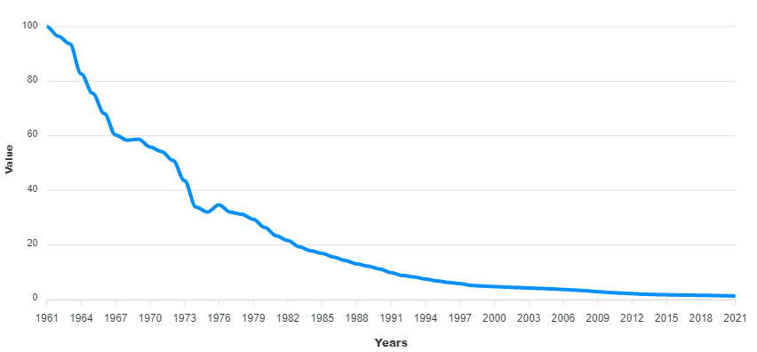

<h1 align="center">Rupee Inflation Dashboard</h1>

  
  
  

Dashboard showing how the buying power of ₹100 has changed over the years

---

  <a href="https://github.com/thepushkarp/rupee-inflation-dashboard" target="_blank" rel="noopener noreferrer">
    Rupee Inflation Dashboard
  </a>
  made with ❤️ by
  <a href="https://github.com/thepushkarp">
    Pushkar  Patel
  </a>

